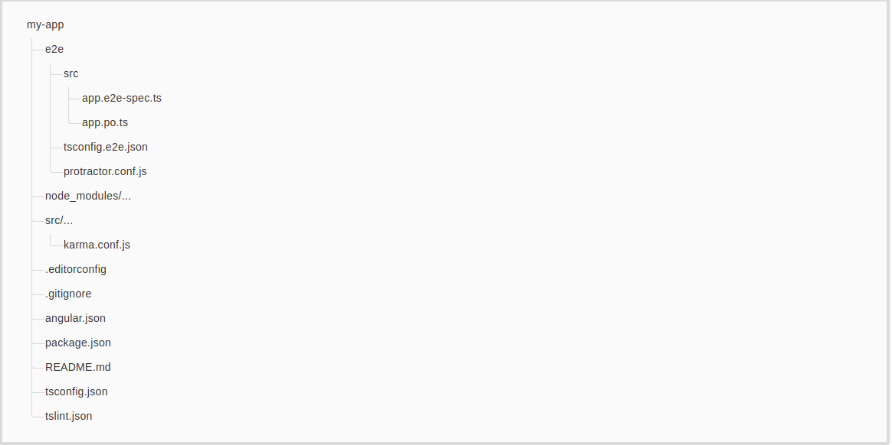

# Project Structure of Angular
- Meaning of each file
- Flow of angular file

# The src folder
Your app live in the src folder. All Angular components, templates, styles, image and any else your app needs go here. Any file outside of this folder are meant to support building your app.

### app/app.component.x   {ts,html,css,spec.ts}
Defines the AppComponent. It is the root component of what will become a tree of nested components as the application evolves. Project must comtain one component

### app/app.module.ts 
Defines AppModule, the root module that tells Angular how to assemble the application. Right now it declares only the AppComponent.

### assets folder
Where we can store static assets of our application like image , icon etc.

### environment folder
Where we can store configuration settings for different enviroments. Basically, this folder contains two files,  
- environment.prod.ts : File for the production environment.
- environment.ts :  File for development enviroment.

### favicon.ico
It is an icon file which displays on the browser.

### index.html
The file contains our Angular application. All other pages are dynamically inserted into the page.

### main.ts
It file is a TypeScript file. It is the starting point of our application. Here, we can bootstrap (The process of initializing or loading) our main module(app.module) using bootstrapModule method like,  
platformBrowserDynamic().bootstrapModule(AppModule).

### style.css
Its is a file where we can add global styles for our applications.

### polyfills.ts
File basically imports scripts required for running Angular because angular framework uses the features of javascript which are not available in the current version of javascript supported by the most browser. So, basically it fills the gap to give the features of javascript that are needed by Angular and the feature supported by current browser.  
Polyfills files can be divided into two part,  
- Browser Polyfills these are applied before loading zone.js and sorted by the browser.
- Application imports files imported after zone.js file, they should be loaded before your main file.

## root folder
The src/ folder is just one of the items inside the project's root folder. Other files help you build, test, maintain, document, and deploy the app. These files go in the root folder next to src/

### test.ts
This file is used for setting the testing environment.

### e2e
e2e stands for "end to end", this is the place where we can write the end to end test. The end to end test is basically an automated test that simulates a real user.  
So , we can write code to launch our browser. Navigate to the home page of our application, then click a few links etc. are the example of end to end testing.

### node_module
In this folder, ther are third party libraries on which the application may depend. This folder is purely for development.

### editorconfig
This file is used when we are working in a team environment. If we are working in a team environment then make sure that all developers of a team use the same setting in this file.

### Karma.conf.js
This file is used to store the setting of Karma i.e test cases.

### package.json
This file is a standard file. Every node and Angular project contain this file. Basically, this file contains all information like name of the project , verions infomation , dependencies and dev-dependencies settings.

