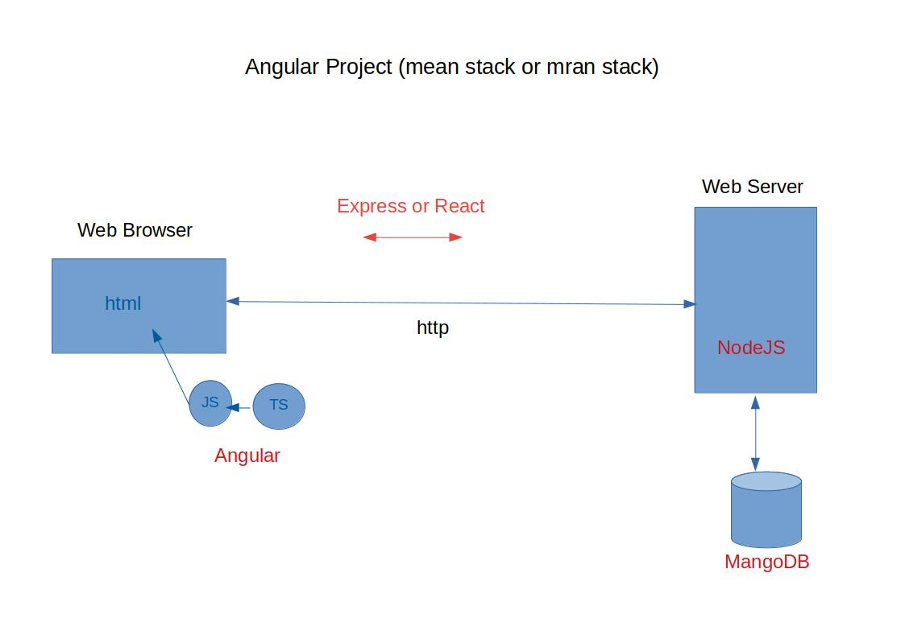

# Angular

__Angular is a typescript based open-source front-end web application platform__ led by the Angular team at Google.

Angular is use to build applications that live on the web, mobile, or the desktop.

---

## Angular Topics

- [Introduction to Web development]
- [Web development types and required skillset]
- [Client Server Architecture in Web Development]
- [Introduction to Document Object Model]
- [Use of HTML and CSS to design webpage]
- [Components of MEAN stack Development]
- [Introduction to JavaScript]
- [Introduction to TypeScript]
- [TypeScript vs JavaScript]
- [Introduction to Angular Framework]
- [Installation steps for Angular]
- [Angular CLI commands]
- [Use of Visual Studio Code as IDE]
- [Project structure of Angular]
- [Creating First Angular Project]
- [Module in Angular]
- [Component in Angular]
- [Binding Concept]
- [Two Way Binding]
- [Template Reference Variable]
- [Inter Component Communication]
- [Angular Directives]
- [Routing]
- [Angular Service]
- [Angular Dependency]
- [Angular Observables]
- [Server communication using HTTP]
- [Angular Forms]
- [Angular Forms validation techniques]
- [Pipe in Angular]

  - [Inbuild Pipe]
  - [Custom Pipe]

- [Frontend developing using Bootstrap]
- [Frontend developing using Material Design]
- [Introduction to cloud]
- [Angular FireBase]
- [Introduction to Amazon web services]
- [Unit Testing of Angular Application]
- [Introduction To NodeJS]
- [Client Side Application Development using React]
- [Webpack]

---

- [More About Angular](./Angular.md#More-About-Angular)
- [Angular CLI](./AngularCLI.md)
- [Project Structure of Angular](./Project_Structure.md)
- [Component](./Component.md#component)
- [Template](./Template.md)
- [Directives](./Directives.md)
- [Bootstrapping](./Bootstrapping.md)
- [Dependence Injection]
- [Service]
- [Routing]
- [Material Design]
- [BootStrap]
- [HttpClient]
- [Forms]
- [Testing]
- [NgModule](./NgModule.md)
- [EXPLORE ANGULAR RESOURCES](https://angular.io/resources)

---

## More About Angular

1. [Angular and AngularJS](#Angular-and-AngularJS)
1. [Versions of Angular](#Versions-of-Angular)
1. [Feature of Angular](#Feature-of-Angular)
1. [Why Javascript is removed from Angular](#Why-Javascript-is-removed-from-Angular)
1. [Where the Angular is use](#Where-the-Angular-is-use)

---

## Angular and AngularJS

- AngularJS is JavaScript Framework developed by Google.
- Angular is TypeScript based Framework it is also developed by Google.
- Angular is a AngularJs without JavaScript.
- Angular is developed by same team how developed AngularJS

---

## Versions of Angular

- AngularJS referring to the 1.x version.
- Angular without the "JS" referring to versions 2 and up.
- Angular have sematic version (major.minor.patch).
- We are to learn Angular 6.0.0 (6 major 0 minor 0 patch)

---

## Feature of Angular

1. Angular is used to create SPA ( Single Page Application ). But we can create MPS (Multi Page Application) using Routing concept.
1. Module Programming (we write one time and use multiple time any other project also).
1. Develop across all platforms (mobile, computer and tab).
1. Speed & Performance.
1. We can make static web application.

---

## Why Javascript is removed from Angular

1. __Javascript is losely type language.__

    - One of the great things about type checking is that
        - It helps when writing code because it can prevent bugs at compile time and
        - It helps when reading code because it clarifies your intentions.

    - Return datatype:
        - if we accidentally return anything other than a string in our code, the compiler will tell us that we made a mistake
        - any other developers who want to use this function know precisely what type of object they’ll be getting.

    - Bug is determine at the time of comipling.

---

## Where the Angular is use

Angular is use at client side. To make our webapp more interactive.

---

__[Main Menu](./Angular.md#Angular-Topics)__