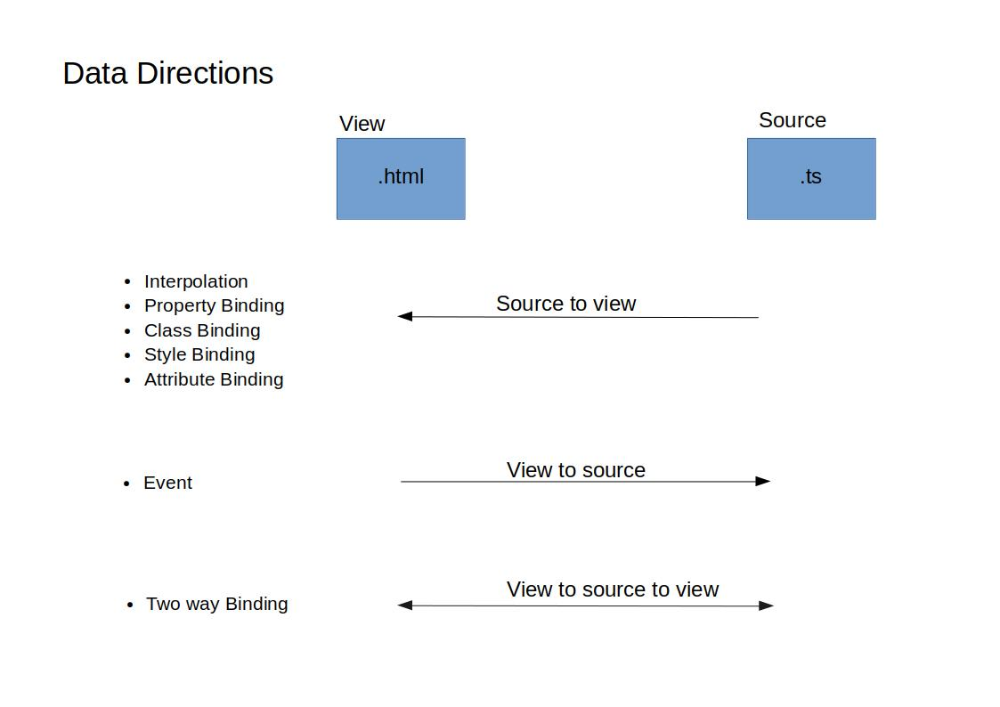

# Template

Template is a combination of original html with angular directive and binding markup

1. [HTML in template](#html-in-template)
2. [Data Binding](#data-binding)
    - One way. ( source -> view )
    - One way. ( view   -> source )
    - Two way. ( view   -> source -> view ).
3. [Binding types](#Binding-types)
    - Interpolation.
    - Property Binding.
        - HTML attribute and DOM properties
    - Class Binding.
    - Style Binding.
    - Attribute Binding.
    - Event Binding.
    - Two way Binding.
4. [Template Expression](../Angular6-code/Component_And_Template/Interpolation/README.md#template-expression)
5. [Template Statement](../Angular6-code/Component_And_Template/Event-Binding/README.md#template-statement)
6. Template Reference Variable. ( #var )
7. Template Input Variable.
8. Input and Ouput properties.
9. Template Expression operator.
    - The Pipe Operator.  ( | )
    - The safe navigation operator ( ?. )
    - Non-Null sssertion operator ( !. )
    - $any type cast function.
10. Directive.

---

## HTML in template

- HTML is language of the Angular template.
- Almost all the HTML syntax is valid except `<srcit>` tag.
- `<html> <body> <base>` have no useful role.

---

## Data Binding

- Push Values to and pull value from HTML.

- **Binding data source(component) and view target(HTML).**

## Binding Types

Binding types can be grouped into three categories distinguished by the direction of data flow:

1. Source To View
    - [Interpolation](../Angular6-code/Component_And_Template/Interpolation/README.md)
    - [Property Binding](../Angular6-code/Component_And_Template/Property-Binding/README.md)
    - [Class Binding](../Angular6-code/Component_And_Template/Class-Binding/README.md)
    - [Style Binding](../Angular6-code/Component_And_Template/Style-Binding/README.md)

2. View To Source
    - [Event Binding](../Angular6-code/Component_And_Template/Event-Binding/README.md)

3. View To Source To View
    - [Two Way Binding](../Angular6-code/Component_And_Template/Two-Way-Binding/README.md)

---